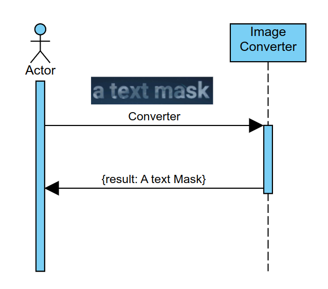
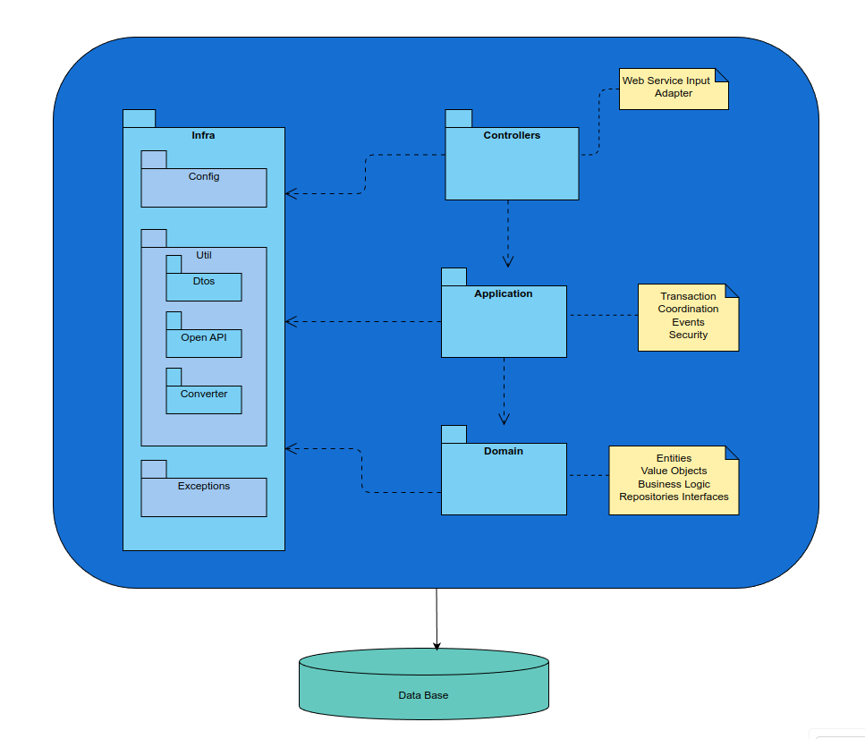

# image-converter-service

[](https://opensource.org/licenses/Apache-2.0)
[](https://img.shields.io/badge/Project%20status-Maintenance-orange.svg)

# Project status

I use this project to learn new technologies related to spring boot web.
I change this project constantly improving and adding new plugins, click [here](docs/STATUS.md) to follow up.

# The Problem

I needed to transform an image with a bill number code to a text in order to use it on other software.
Yes, Google has/had a service for that, but you have to pay :(

# About

This project converts images with text into simple text using [tesseract](https://github.com/tesseract-ocr/tesseract) and exposes it as a web service using spring boot.



Basically, the caller sends a request (post) with an image with text, and the project tries to find the text on this image, returns it as text, and stores the conversion on a database.

Basic overall architecture:



For more information plese check the [project development site](https://fernando-romulo-silva.github.io/image-converter-service/).

# Technologies

- Git
- Java
- Maven
- Spring Frameworks (boot, data, security, Open API, etc.)
- Tesseract
- Docker

# Requirements

These are the requirements:

- Git

```bash
# check the git version
git --version
```

- Java version >= 17 

```bash
# check the Java version
java --version
```

- Ant version >= 1.10 (optional)

```bash
# check the Ant version
ant -version
```
- Maven version >= 3.8.8

```bash
# check the Maven version
mvn --version
```

- Docker

```bash
# check the Docker version
docker --version
```

- Newman (for tests)

```bash
# check the Newman version
newman --version
```

# How to Execute

To execute, please folow these steps:

## Get parent's project

This project use the [allset-java](https://github.com/fernando-romulo-silva/allset-java) parent maven project to use plugins and configurations. 

Please get this project and install it on your repository before continuing.

## Get extension's project

This project use the [default-extensions](https://github.com/fernando-romulo-silva/default-extensions) to use plugins configurations (checkstyle-checks.xml, pmd-ruleset.xml, spotbugs-excludes.xml, etc).

## To install

Please get this project and install it on your repository before continuing.

To start, clone it:

```bash
git clone https://github.com/fernando-romulo-silva/image-converter-service
```

You have to be in the project's root directory:

```bash
cd image-converter-service
```

Build the application:

```bash
mvn package -DskipTests
```

## To Execute

**Using Docker**

It is recommended to use this process because using docker you don't need to install and configure tesseract on your pc:

```bash 
docker build --build-arg BUILD_DATE=$(date -u +'%Y-%m-%dT%H:%M:%SZ') \
             --file src/main/docker/Dockerfile \
             --tag image-converter-service .
```

To run the project:

```bash 
docker run --publish 8080:8080 \
           --publish 8000:8000 \
           --detach \
           --memory 1Gb \
           --memory-reservation 256Mb \
           --name image-converter-service-1 \
           --env-file src/main/docker/AlpineVersion.env \
           --log-opt mode=non-blocking \
           --log-opt max-buffer-size=16m \
           image-converter-service
```

**Using Java Local**

Tesseract needs a dictionary and the application uses the English dictionary called 'eng.traineddata.'
For example, Ubuntu Ubuntu Linux (22.04.2 LTS) and tesseract 4, the default dictionary is installed on /usr/share/tesseract-ocr/4.00/tessdata/ and Alpine linux (3.15.0) and tesseract 4, the default dictionary is installed on /usr/share/tessdata/

You have to check where the dictionary was installed on your S.O.

First, define where the dictionary folder was installed:

```bash
export TESSERACT_FOLDER=/usr/share/tesseract-ocr/4.00/tessdata/
```

Next check if tesseract is working:

```bash
tesseract --version
```

Then execute:

```bash
mvn spring-boot:run -Dspring.profiles.active=local
```

## Testing the application

There is a Postman collection that you can use to test it, but you can use Newman.
To do that, execute the following command inside the project folder to test:

```bash
newman run src/test/resources/postman/image-converter-service.postman_collection.json \
          -e src/test/resources/postman/image-converter-service-local.postman_environment.json
```

# API Documentation

To access the API's documentation:

```url
http://localhost:8080/swagger-ui/index.html?configUrl=/v3/api-docs/swagger-config
```
